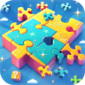

- **App Name**: Jigsaw Puzzle
- **App Icon**: 
- **App Description**: Jigsaw Puzzle, is a journey of putting together exciting puzzles. Place fragments together piece by piece to create a completed picture. This game puts your observation skills and spatial imagination to test.
- **One Liner for Your Application**: Jigsaw Puzzle, is a journey of putting together exciting puzzles.
- **App Category**: GameFi.
- **App Link**: 
- **Screenshots / Picture / Banner**: 
- **Link to App’s GitHub Repository**: BounceBit