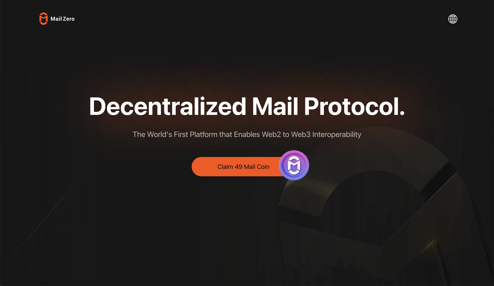

- **App Name**: MailZero.
- **App Icon**: .
- **App Description**: MailZero Network is a Decentralized Mail Protocol aiming to unify the communication amongst Web2 and Web3.Lowering the barrier for email users and service providers to start monetizing their email addresses and services.At its core, MailZero is an ecosystem where email users and service providers can keep a much bigger share of their earnings while holding a stake in the platform.MailZero Network aiming to unify the communication amongst Gmail, Bitcoin network (BTC) and EVM networks.
- **One Liner for Your Application**: Decentralized Mail Protocol supports the Ordinals & BRC20 ecosystem.
- **App Category**: SocialFi
- **App Link**: https://mailzero.network/
- **Screenshots / Picture / Banner**: 
- **Smart Contract Source Code**: 
  ``` sol
  https://github.com/MailZeroProtocol/MailZeroxBounceBit/blob/main/OmniStamp.sol
  https://github.com/MailZeroProtocol/MailZeroxBounceBit/blob/main/GenesisStamp.sol

  nft OmniStamp image: https://mailzero.network/BounceBitOmniStamp.png
  nft GenesisStamp image: https://mailzero.network/MailZeroxBounceBitGenesisStamp.png
  ```
