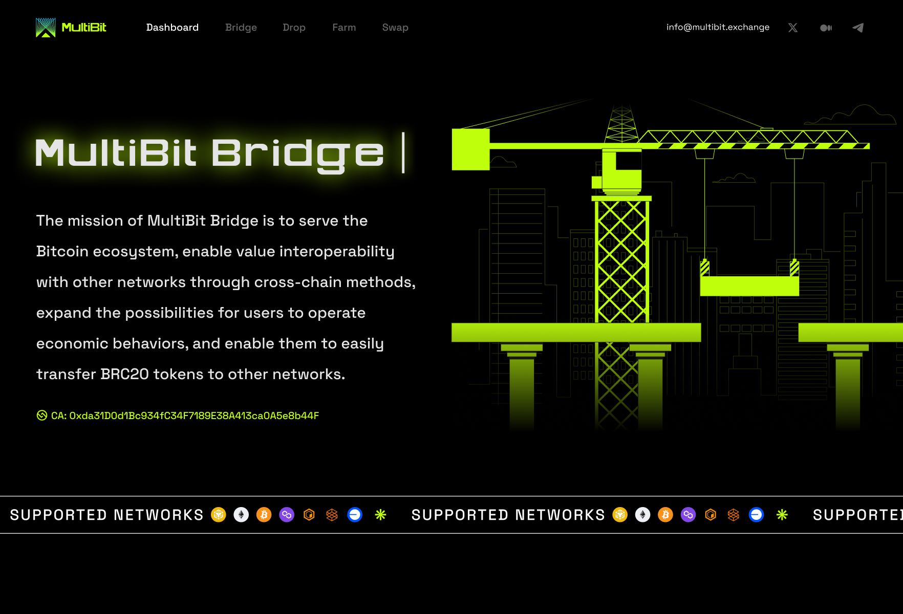

- **App Name**: MultiBit
- **App Icon**: 80x80 image and svg image
   
   

   
  
- **App Description**: The mission of MultiBit Bridge is to serve the Bitcoin ecosystem, enable value interoperability with other networks through cross-chain methods, expand the possibilities for users to operate economic behaviors, and enable them to easily transfer BRC20 tokens to other networks.

- **One Liner for Your Application**: MultiBit breaks down the barrier between the BTC and EVM chains.

- **App Category**: Bridge.

- **App Link**: [https://multibit.exchange](https://multibit.exchange)

- **Screenshots / Picture / Banner**: 1x/3x preview image

- **Link to App’s GitHub Repository**: [https://github.com/multibit-repo](https://github.com/multibit-repo)

- **Smart Contract Source Code**: -
