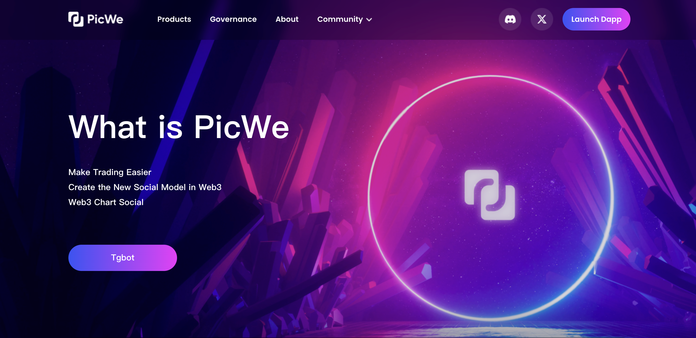

## App Name
PicWe

### App Icon

### App Description
PicWe is An Omni-chain Decentralized Securities Trader Infra.Here`s the Highlights:
1.Create Public Goods for Massive Adoption by State Identification Service(SIS) which is the New Infrastructure for Layer 3. With SIS we can Make Builder Easier and Make Assets Safe.
2.Aggregate Trading with the Cex&Dex.
3.With our Starlight (AA) wallet users can easily enter the blockchain world.

### One Liner for Your Application
PicWe is An Omni-chain Decentralized Securities Trader Infra

### App Category
DeFi

### App Link
[website](https://app.picwe.org/)

### Screenshots / Picture / Banner

### Link to App’s GitHub Repository
https://github.com/Copariot-Labs

### Smart Contract Source Code
[Source Code link](https://github.com/Copariot-Labs/StateIdentification-contract.git)

