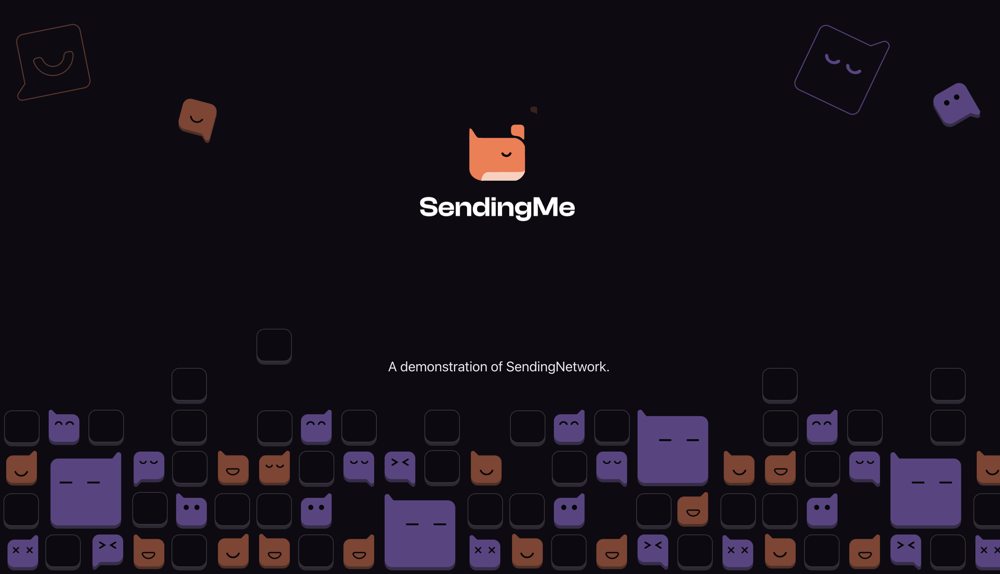

- **App Name**: SendingMe
- **App Icon**: 
- **App Description**: Chat - Enjoy free, encrypted one-on-one or in-group chats supporting texts, images, emojis, voice, video and files. Our mission is to provide you with a safe and secure chat experience while maintaining full ownership of your private data; Explore Mini Programs- SendingMe enables easy integration with popular third party dApps. Now you can browse, explore and chat all in one place; Social - Post your proud digital collectibles and show off to the world, or turn your own space into an art gallery. You can also discover interesting communities and trending topics or follow your favorite influencers and join their private group; Come join us on SendingMe, a SAFE, SECURE, POWERFUL app where you can truly enjoy all things social while maintaining ownership of your data; Our Mission & Vision - Empower users with true data freedom in a secured environment and Building an open & decentralized social ecosystem.
- **One Liner for Your Application**: SendingMe is a decentralized and encrypted super-app that combines chat, socializing, and trade, giving you complete control over your social layer.
- **App Category**: SocialFi.
- **App Link**: https://chat.sending.me
- **Screenshots / Picture / Banner**: 
- **Link to App’s GitHub Repository**: https://github.com/Sending-Network