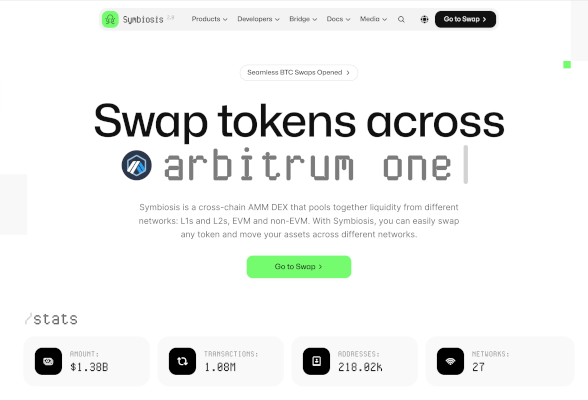

- **App Name**: Symbiosis
- **App Icon**: 
- **App Description**: Symbiosis is a cross-chain AMM DEX that pools together liquidity from different networks: L1s and L2s, EVM and non-EVM. With Symbiosis, you can easily swap any token and move your assets across different networks.
- **One Liner for Your Application**: Swap any to any tokens in one click
- **App Category**: DeFi.
- **App Link**: https://app.symbiosis.finance
- **Screenshots / Picture / Banner**: 
- **Link to App’s GitHub Repository**: https://github.com/symbiosis-finance