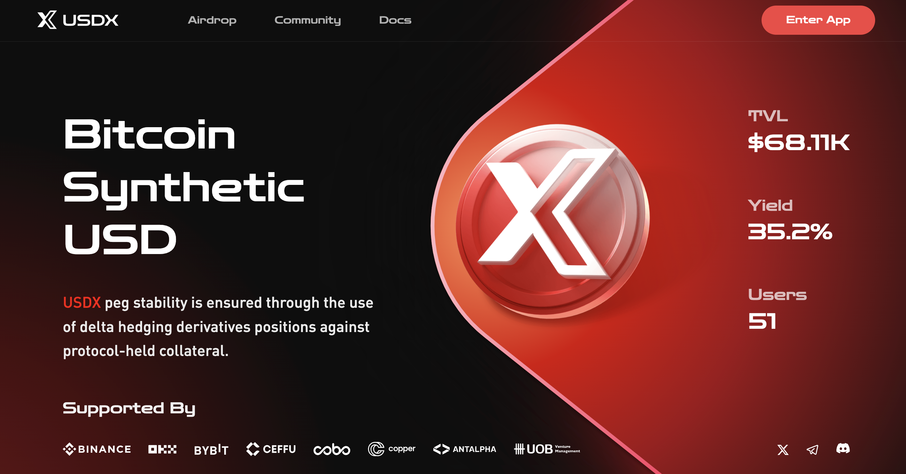

- **App Name**: USDX.
- **App Icon**: 
- **App Description**: USDX is a synthetic USD stablecoin built for the Bitcoin and wider blockchain ecosystem. It offers a crypto-native stablecoin solution that do not rely on traditional banking infrastructure which is censorship-resistant, scalable, and highly stable. Furthermore, it provides a savings tool accessible worldwide in USD denomination. 
USDX will ensure the stability of the peg through a delta-neutral portfolio strategy. At the same time, it will provide denominated returns to holders or ecosystem participants of USDX.
- **One Liner for Your Application**: USDX peg stability is ensured through the use of delta hedging derivatives positions against protocol-held collateral.
- **App Category**: DeFi,Stablecoin
- **App Link**: https://app.usdx.money
- **Screenshots / Picture / Banner**: 
- **Smart Contract Source Code**: 
  ``` sol
   In development
  ```
